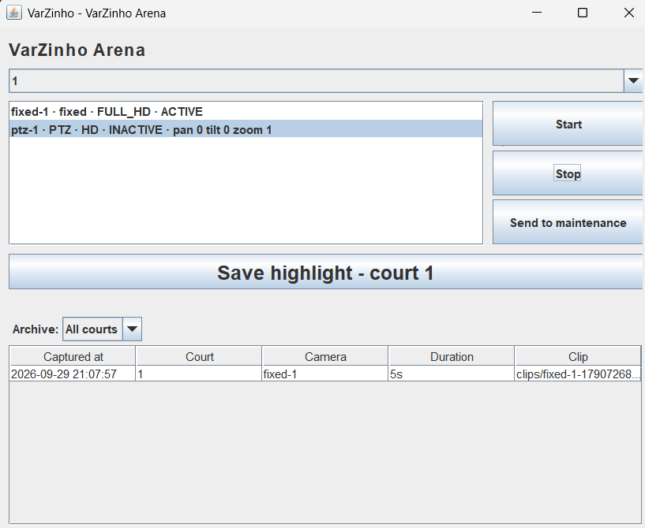
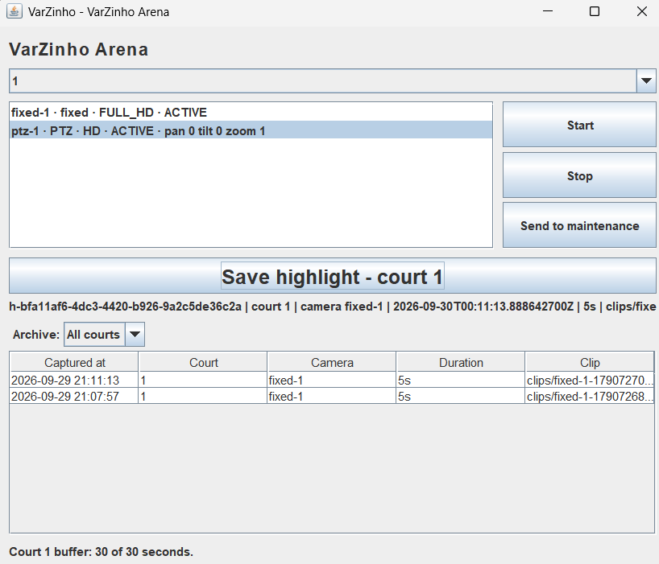
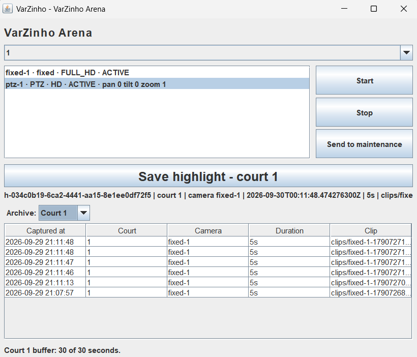
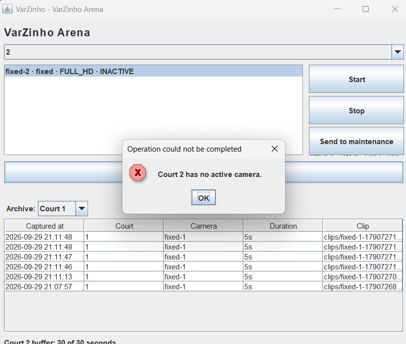

# VarZinho

> O sistema não filma o lance. Ele lembra dele.

Sistema de captura de lances para ginásios esportivos. As câmeras gravam
continuamente em um buffer circular de 30 segundos; quando acontece um gol ou
uma jogada bonita, o atleta aciona um botão e aquele trecho é salvo como vídeo
permanente. Depois é só pedir o vídeo ao operador, que tem o acervo inteiro.

O foco é futebol, mas o sistema não conhece esporte nem tipo de jogada: serve a
qualquer modalidade que o ginásio jogue.

## A regra central

**O acionamento não inicia a gravação. Ele preserva o que já foi gravado.**

Quando o lance acontece, ele já terminou. Se o botão apenas iniciasse a
gravação, o lance estaria perdido. Por isso a câmera grava de forma contínua
em um buffer circular que retém os últimos 30 segundos e descarta
automaticamente o conteúdo mais antigo.

Essa regra explica quase todas as decisões do projeto — inclusive por que o
lance não registra ninguém: no momento da captura não existe nenhuma camada de
identificação de usuário, apenas um botão sendo apertado. Quem quer o vídeo
procura o operador, que localiza pela quadra e pelo horário.

## Sobre o projeto

Trabalho da disciplina **AL0330 — Programação Orientada a Objetos**
(Engenharia de Software, Unipampa Alegrete, 2026/2).

O objetivo é a **modelagem do domínio** — classes, relacionamentos,
encapsulamento, herança, polimorfismo e tratamento de exceções. O sistema é
operado por uma interface gráfica mínima em Swing, exigida pelo enunciado, e
verificado por testes automatizados.

Não há captura real de vídeo: o `VideoClip` guarda apenas os metadados do
arquivo — caminho, duração, resolução e tamanho. Nenhum quadro é decodificado.

## Tecnologias

- Java 17 (LTS)
- Maven
- JUnit 5

## Instalando o Maven

Você precisa do JDK 17 (ou superior) e do Maven. O build para com uma mensagem
clara se o JDK for anterior ao 17.

| Sistema | Comando |
|---|---|
| Windows | `choco install maven` num terminal de administrador — depois **feche e reabra o terminal**. Sem o Chocolatey: baixe o zip em <https://maven.apache.org/download.cgi>, extraia e adicione a pasta `bin` ao `PATH` (o pacote `Apache.Maven` não existe no `winget`) |
| macOS | `brew install maven` |
| Linux (Debian/Ubuntu) | `sudo apt install maven` |

Para conferir a instalação:

```bash
java -version   # deve mostrar 17 ou superior
mvn -v          # deve mostrar a versão do Maven e o mesmo JDK
```

## Como executar

```bash
mvn compile
mvn test
mvn exec:java
```

`mvn exec:java` abre a janela Swing ([Main](src/main/java/br/edu/unipampa/varzinho/Main.java)
→ [VarZinhoWindow](src/main/java/br/edu/unipampa/varzinho/ui/VarZinhoWindow.java)).
Os lances salvos ficam em `data/highlights.csv` e reaparecem na próxima execução.

Há também uma demonstração em modo texto, sem janela, que percorre o fluxo
inteiro — cadastra ginásio, quadras, atleta e operador, grava, captura, salva,
recarrega do CSV e provoca o erro de quadra sem câmera ativa:

```bash
mvn compile exec:java -Dexec.mainClass=br.edu.unipampa.varzinho.ConsoleDemo
```

### O que a interface faz

A janela abre sobre um ginásio de exemplo já montado
([SampleGym](src/main/java/br/edu/unipampa/varzinho/ui/SampleGym.java)): a
quadra 1 tem uma câmera fixa e uma PTZ, a quadra 2 tem uma câmera fixa, e todas
já estão gravando. Um relógio de um segundo alimenta os buffers enquanto a
janela está aberta.

Nela o usuário:

- **escolhe a quadra** numa lista e vê as câmeras instaladas, cada uma com o seu
  estado atual;
- **seleciona uma câmera e muda seu estado** com *Start*, *Stop* e *Send to
  maintenance*;
- **aciona *Save highlight***, o equivalente na tela ao botão físico da quadra:
  o lance é capturado, gravado no arquivo e confirmado abaixo do botão;
- **consulta o acervo** numa tabela, com todos os lances ou filtrados por quadra,
  do mais recente para o mais antigo.

A entrada de dados é feita por seleção e botões, sem campos de texto. Ginásio,
quadras, câmeras e pessoas não são cadastrados pela janela: a janela usa o
ginásio de exemplo, e o cadastro de pessoas aparece apenas no `ConsoleDemo`.

Quando o domínio recusa uma operação — capturar numa quadra sem câmera ativa,
capturar antes de haver segundos suficientes no buffer, ligar uma câmera em
manutenção, ler um arquivo danificado — a janela mostra a mensagem num
`JOptionPane`, sem encerrar o programa.

## Principais classes

Caminhos relativos a `src/main/java/br/edu/unipampa/varzinho/`.

| Classe | Pacote | Papel |
|---|---|---|
| [`Gym`](src/main/java/br/edu/unipampa/varzinho/domain/structure/Gym.java) | `domain.structure` | O ginásio: registra quadras e pessoas, e recusa números e documentos repetidos |
| [`Court`](src/main/java/br/edu/unipampa/varzinho/domain/structure/Court.java) | `domain.structure` | A quadra: instala e remove câmeras e dispara a captura (`triggerCapture()`) |
| [`Camera`](src/main/java/br/edu/unipampa/varzinho/domain/capture/Camera.java) | `domain.capture` | Abstrata. Controla o estado da câmera e o seu buffer; cada subtipo produz o clipe à sua maneira |
| [`FixedCamera`](src/main/java/br/edu/unipampa/varzinho/domain/capture/FixedCamera.java), [`PtzCamera`](src/main/java/br/edu/unipampa/varzinho/domain/capture/PtzCamera.java) | `domain.capture` | Câmera fixa, com ângulo definido na instalação; câmera móvel, com pan, tilt e zoom validados |
| [`CircularBuffer`](src/main/java/br/edu/unipampa/varzinho/domain/capture/CircularBuffer.java) | `domain.capture` | Memória de tamanho fixo que sobrescreve o quadro mais antigo |
| [`Frame`](src/main/java/br/edu/unipampa/varzinho/domain/capture/Frame.java) | `domain.capture` | Um segundo de gravação: instante e posição na sequência, sem imagem |
| [`Highlight`](src/main/java/br/edu/unipampa/varzinho/domain/highlight/Highlight.java) | `domain.highlight` | O lance salvo, imutável: quando, em que quadra, por qual câmera e qual clipe |
| [`VideoClip`](src/main/java/br/edu/unipampa/varzinho/domain/highlight/VideoClip.java) | `domain.highlight` | Metadados do arquivo de vídeo: caminho, duração, resolução e tamanho estimado |
| [`Person`](src/main/java/br/edu/unipampa/varzinho/domain/people/Person.java), [`Athlete`](src/main/java/br/edu/unipampa/varzinho/domain/people/Athlete.java), [`Operator`](src/main/java/br/edu/unipampa/varzinho/domain/people/Operator.java) | `domain.people` | Pessoas do ginásio. `Person` é abstrata e identificada pelo documento |
| [`CameraStatus`](src/main/java/br/edu/unipampa/varzinho/enums/CameraStatus.java), [`Resolution`](src/main/java/br/edu/unipampa/varzinho/enums/Resolution.java) | `enums` | Estado da câmera (e se ela grava); resolução e suas dimensões |
| [`HighlightRepository`](src/main/java/br/edu/unipampa/varzinho/repository/HighlightRepository.java) | `repository` | Interface do acervo. `CsvHighlightRepository` grava em arquivo; `InMemoryHighlightRepository` guarda em memória |
| [`DomainException`](src/main/java/br/edu/unipampa/varzinho/exception/DomainException.java), [`RepositoryException`](src/main/java/br/edu/unipampa/varzinho/exception/RepositoryException.java) | `exception` | Raízes das exceções próprias do domínio e da persistência |
| [`VarZinhoWindow`](src/main/java/br/edu/unipampa/varzinho/ui/VarZinhoWindow.java) | `ui` | A janela. Monta `CourtPanel`, `CapturePanel` e `ArchivePanel` e mostra os erros |

## Regras de negócio

O que torna o sistema mais do que um cadastro:

1. **O buffer é circular.** Cada câmera guarda os últimos 30 segundos. Gravar com
   o buffer cheio sobrescreve o quadro mais antigo (`CircularBuffer.record()`).
2. **Câmera desligada não grava.** Uma câmera fora do estado `ACTIVE` descarta
   os quadros que recebe (`Camera.record()`, `CameraStatus.canRecord()`).
3. **Capturar exige câmera ativa.** Acionar a captura numa quadra sem nenhuma
   câmera gravando lança `NoActiveCameraException`, e nenhum lance vazio é
   criado (`Court.triggerCapture()`).
4. **Capturar exige passado gravado.** O lance corresponde aos últimos 5
   segundos do buffer (`Court.DEFAULT_CAPTURE_SECONDS`). Se a câmera ainda não
   gravou esse tempo, lança `EmptyBufferException`.
5. **Câmera parada não entrega gravação antiga.** Uma câmera desligada mantém o
   que tinha no buffer, mas se recusa a transformá-lo em clipe, para não
   apresentar o passado como se fosse o presente (`Camera.recordedWindow()`).
6. **Manutenção é um estado à parte.** Uma câmera em manutenção não pode ser
   ligada nem desligada; a tentativa lança exceção (`Camera.startRecording()`,
   `Camera.stopRecording()`).
7. **O lance não tem autor e não muda.** `Highlight` recebe tudo no construtor e
   não tem setters. Não registra quem jogou nem quem apertou o botão, porque o
   botão não carrega identidade.
8. **Não há duplicidade.** O ginásio recusa duas quadras com o mesmo número e
   duas pessoas com o mesmo documento (`Gym.addCourt()`, `Gym.registerPerson()`).
9. **Os limites físicos são respeitados.** A PTZ gira de 0 a 359° (pan), inclina
   de -90 a 90° (tilt) e aproxima de 1 a 10 (zoom) (`PtzCamera.moveTo()`). A
   camisa do atleta vai de 1 a 99, e a data de nascimento não pode estar no
   futuro.
10. **Uma linha danificada não derruba o acervo.** Se uma linha do CSV não puder
    ser lida, `CorruptedRecordException` informa a linha e carrega os lances que
    foram recuperados, e a janela exibe esses lances. A escrita usa um arquivo
    temporário e uma troca atômica, para que uma queda durante a gravação não
    apague o acervo.

## Checklist de avaliação

O checklist da seção 3 do [enunciado](docs/ASSIGNMENT-BRIEF.md), indicando onde
cada conceito foi usado e por que faz sentido no domínio.

| Conceito | Onde foi utilizado | Por que faz sentido no domínio |
|---|---|---|
| Classes e objetos | [`SampleGym.build()`](src/main/java/br/edu/unipampa/varzinho/ui/SampleGym.java) instancia `Gym`, `Court`, `FixedCamera` e `PtzCamera`. `Court.triggerCapture()` cria o `Highlight`, e `Camera.clipFrom()` cria o `VideoClip` | Cada classe é algo que existe no ginásio: prédio, quadra, câmera, lance, arquivo de vídeo, pessoa |
| Atributos | `CircularBuffer` (`frames`, `writePosition`, `size`), `Camera` (`id`, `resolution`, `status`, `buffer`), `PtzCamera` (`pan`, `tilt`, `zoom`), `VideoClip` (`filePath`, `durationSeconds`, `resolution`, `sizeMb`) | O estado guardado é o que o equipamento tem de fato: onde o buffer está escrevendo, se a câmera grava, para onde a PTZ aponta |
| Métodos | `Court.triggerCapture()`, `CircularBuffer.record()` e `extractLastSeconds()`, `Camera.startRecording()`, `stopRecording()` e `sendToMaintenance()`, `PtzCamera.moveTo()`, `Person.age()` | O comportamento fica no objeto que o executa: quem captura é a quadra, quem sobrescreve é o buffer, quem se move é a PTZ |
| Desafio da aula | Não se aplica a este repositório: o desafio foi uma atividade feita em sala e não é um artefato deste projeto | Os mesmos fundamentos (classes, atributos, métodos e construtores) aparecem aplicados no domínio nas linhas *Classes e objetos*, *Atributos*, *Métodos* e *Construtores* deste checklist |
| Construtores | Todos validam antes de atribuir e lançam exceção se o objeto ficaria inválido: `Camera`, `Person` (rejeita nascimento no futuro), `Athlete` (camisa de 1 a 99), `VideoClip`, `Highlight`, `CircularBuffer`, `Court`, `Gym` | Não existe câmera sem identificador nem lance sem clipe. Um objeto que existe é um objeto válido, e por isso não há setters |
| `this` | `this.id = id` e os demais campos no construtor de [`Camera`](src/main/java/br/edu/unipampa/varzinho/domain/capture/Camera.java). `this.pan = pan` em `PtzCamera.moveTo()`, onde o parâmetro tem o mesmo nome do atributo. `this(...)` encadeando construtores em [`CorruptedRecordException`](src/main/java/br/edu/unipampa/varzinho/repository/CorruptedRecordException.java) | O parâmetro e o atributo têm o mesmo nome porque representam a mesma coisa; `this` desfaz a ambiguidade |
| Modificadores | Todos os atributos são `private`, quase todos `final`. Os construtores de `Camera`, `Person` e `DomainException` são `protected`. `recordedWindow()` e `clipFrom()` são `protected final`. Os painéis de `ui/` são visíveis só dentro do pacote. Classes folha são `final`. `Main` e `SampleGym` têm construtor `private` | Só as subclasses podem ler o buffer da câmera e nenhuma pode mudar essa regra. Do pacote `ui`, só a janela e o ginásio de exemplo são públicos; os painéis ficam restritos ao pacote |
| Encapsulamento | O array de quadros de [`CircularBuffer`](src/main/java/br/edu/unipampa/varzinho/domain/capture/CircularBuffer.java) nunca sai da classe. `Camera.status` só muda por `startRecording()`, `stopRecording()` e `sendToMaintenance()`. `Court.getCameras()` e `Gym.getPeople()` devolvem cópias | A regra de sobrescrita só se mantém se ninguém de fora mexer no array. O estado da câmera só muda por operações que validam antes, como recusar ligar uma câmera em manutenção |
| Pacotes | `domain` (com `structure`, `capture`, `highlight` e `people`), `enums`, `exception`, `repository` e `ui` | As três responsabilidades pedidas existem. As **regras de negócio** ficam nas próprias entidades de `domain` (domínio rico), em vez de numa camada de serviço separada que só repassaria chamadas. A **infraestrutura** de persistência fica em `repository`. A **interface gráfica** fica em `ui`, o único pacote que importa `javax.swing`. `domain` não importa nada de `repository`: a dependência aponta para dentro |
| Herança | `Camera` → `FixedCamera`, `PtzCamera`. `Person` → `Athlete`, `Operator`. `DomainException` → `NoActiveCameraException`, `EmptyBufferException`. `RepositoryException` → `CorruptedRecordException` | Toda câmera tem identificador, resolução, estado e buffer; o que muda é como cada tipo produz o clipe. Atleta e operador são pessoas com nome, documento e data de nascimento |
| Polimorfismo | `Court.triggerCapture()` chama `captureLastSeconds()` pelo tipo `Camera`, sem saber qual câmera tem em mãos. [`CourtPanel`](src/main/java/br/edu/unipampa/varzinho/ui/CourtPanel.java) percorre a `List<Camera>` da quadra chamando `describe()`, e a PTZ acrescenta pan, tilt e zoom à sua linha. A janela usa o acervo pelo tipo `HighlightRepository` | A quadra não precisa saber o tipo de câmera instalada. Um novo tipo de câmera não exige mudar `Court`, e trocar o CSV por outro armazenamento não exige mudar a janela |
| `super` | `super(id, model, resolution, bufferSeconds)` em `FixedCamera` e `PtzCamera`, `super(name, document, birthDate)` em `Athlete` e `Operator`, `super(message)` e `super(message, cause)` nas exceções | A validação do que é comum a toda câmera ou a toda pessoa é escrita uma vez, na superclasse, e as subclasses a reaproveitam na inicialização |
| Abstração | [`Camera`](src/main/java/br/edu/unipampa/varzinho/domain/capture/Camera.java) e [`Person`](src/main/java/br/edu/unipampa/varzinho/domain/people/Person.java) são `abstract`, com os métodos abstratos `captureLastSeconds()`, `describe()` e `identify()`. `DomainException` também é abstrata | Não existe "uma câmera" genérica instalada numa quadra, nem "uma pessoa" sem papel no ginásio. `DomainException` existe para ser capturada, nunca lançada |
| Interfaces | [`HighlightRepository`](src/main/java/br/edu/unipampa/varzinho/repository/HighlightRepository.java), implementada por `CsvHighlightRepository` e `InMemoryHighlightRepository` | O formato do acervo pode mudar (o PRD prevê um banco de dados no futuro) sem tocar no domínio nem na interface. A versão em memória permite testar sem arquivo |
| Enum | [`CameraStatus`](src/main/java/br/edu/unipampa/varzinho/enums/CameraStatus.java) (`ACTIVE`, `INACTIVE`, `MAINTENANCE`) com `canRecord()`. [`Resolution`](src/main/java/br/edu/unipampa/varzinho/enums/Resolution.java) (`HD`, `FULL_HD`, `ULTRA_HD`) com largura, altura e `label()` | Uma câmera só pode estar num desses três estados, e a regra "só `ACTIVE` grava" fica no próprio enum. A resolução carrega as dimensões usadas para estimar o tamanho do clipe |
| Tratamento de exceções | Exceções próprias em [`exception/`](src/main/java/br/edu/unipampa/varzinho/exception/): `DomainException` (não verificada), com `NoActiveCameraException` e `EmptyBufferException`, e `RepositoryException` (verificada), estendida por `CorruptedRecordException` em `repository/`. São lançadas em `Court.triggerCapture()`, `CircularBuffer.extractLastSeconds()` e `CsvHighlightRepository`, e tratadas em `CapturePanel` e `ArchivePanel`, que mostram a mensagem num `JOptionPane` | Apertar o botão sem câmera ativa é um erro que o atleta precisa ver, não um lance vazio salvo em silêncio. Um arquivo danificado é recuperável: por isso a exceção é verificada e carrega os lances que puderam ser lidos |
| Interface gráfica com Swing | [`VarZinhoWindow`](src/main/java/br/edu/unipampa/varzinho/ui/VarZinhoWindow.java) (`JFrame`), [`CourtPanel`](src/main/java/br/edu/unipampa/varzinho/ui/CourtPanel.java) (`JComboBox`, `JList`, `JButton`), [`CapturePanel`](src/main/java/br/edu/unipampa/varzinho/ui/CapturePanel.java) (`JButton`), [`ArchivePanel`](src/main/java/br/edu/unipampa/varzinho/ui/ArchivePanel.java) (`JTable`), `JOptionPane` para erros e `javax.swing.Timer` como relógio | O usuário escolhe quadra e câmera, muda o estado da câmera, salva o lance e vê o acervo. A entrada é feita por seleção e botões, sem campos de texto, e não há cadastro pela janela (ver [O que a interface faz](#o-que-a-interface-faz)). A interface não contém regra: chama o domínio e mostra o resultado |
| Data e hora (`java.time`) | `Instant` em `Frame` e `Highlight`. `LocalDate` e `Period` em `Person.age()`. `ZoneId` e `DateTimeFormatter` em `ArchivePanel`. `Instant.parse()` e `DateTimeParseException` em `CsvHighlightRepository`. As classes `Date` e `Calendar` não são usadas | O lance é procurado pelo horário em que aconteceu, então o instante da captura é o dado central. O acervo guarda o `Instant` em UTC e a tabela o exibe no fuso local |

## Capturas de tela



*Equipamentos da quadra: a câmera `ptz-1` está parada e a `fixed-1` está ativa.*



*Captura disparada: o lance foi salvo e a confirmação aparece abaixo do botão.*



*Acervo de lances filtrado pela quadra 1.*



*Disparo numa quadra sem câmera ativa: a exceção de domínio chega à interface como um aviso ("Court 2 has no active camera."). Demonstra a seção 2.8 do enunciado (tratamento de exceções).*

## Documentação

| Documento | Conteúdo |
|---|---|
| [docs/ASSIGNMENT-BRIEF.md](docs/ASSIGNMENT-BRIEF.md) | O enunciado do trabalho — é ele que manda quando houver divergência |
| [AGENTS.md](AGENTS.md) | Convenções de código, build e fluxo de trabalho |
| [CONTEXT.md](CONTEXT.md) | Glossário do domínio e decisões tomadas |
| [docs/PRD.md](docs/PRD.md) | O que o sistema faz, e o que não faz |
| [docs/DOMAIN-MODEL.md](docs/DOMAIN-MODEL.md) | Modelo de domínio e diagrama de classes |
| [docs/ARCHITECTURE.md](docs/ARCHITECTURE.md) | Camadas, persistência e exceções |
| [docs/WORKFLOW.md](docs/WORKFLOW.md) | Branches, commits e pull requests |
| [docs/TESTING.md](docs/TESTING.md) | Como escrevemos testes (TDD) |
| [docs/specs/](docs/specs/) | Especificações por agregado |

## Idioma

**Todo o código e a documentação técnica são escritos em inglês.** Este README
é a única exceção, por ser a porta de entrada do repositório.

## Equipe

Lorenzo Ficher, Lara Rios, Rafael Lopes, Artur Kraemer e Inaurrara Flores.

A divisão do trabalho é por agregado do domínio — cada pessoa é dona de um
conjunto de classes, sem dependência cruzada. Ver
[docs/WORKFLOW.md](docs/WORKFLOW.md).
