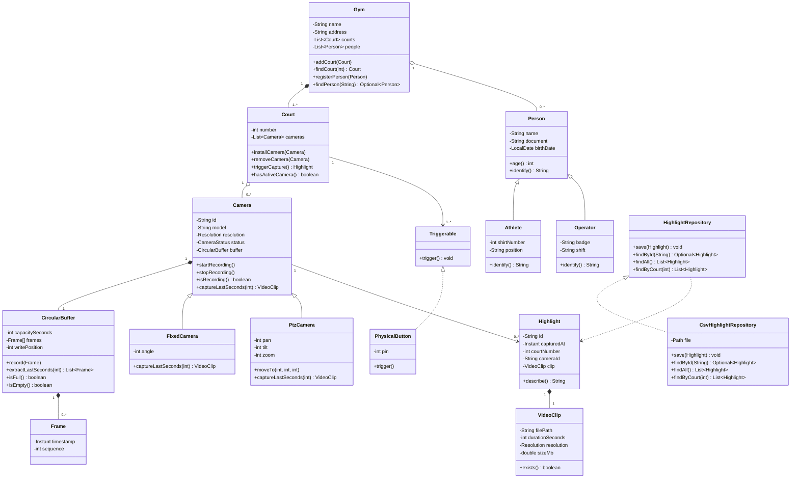

# Domain Model

The classes, their relationships, and the reasoning behind each one. This is
the English, corrected successor of the original `MODELO.md` draft.

## Class diagram

`Camera` and `Person` are **abstract**. `Triggerable` and `HighlightRepository`
are **interfaces**.

## Relationships

| Relationship | Cardinality | Type | Why |
|---|---|---|---|
| Gym → Court | 1 : 1..* | Composition ◆ | A court cannot exist outside its gym |
| Gym → Person | 1 : 0..* | **Aggregation ◇** | A person exists before and after being registered |
| Court → Camera | 1 : 0..* | **Aggregation ◇** | Cameras are movable equipment |
| Camera → CircularBuffer | 1 : 1 | Composition ◆ | Internal memory of the device |
| CircularBuffer → Frame | 1 : 0..* | Composition ◆ | Frames exist only inside the buffer |
| Camera → Highlight | 1 : 0..* | Association → | Highlights outlive the camera |
| Highlight → VideoClip | 1 : 1 | Composition ◆ | Without a clip there is no highlight |

### Composition or aggregation?

The test: *if the whole is removed, does the part still make sense alone?*

**Gym and court** — demolish the building and the court is gone. Composition.

**Court and camera** — uninstall the camera and it goes to the storeroom, gets
repaired, gets mounted on another court. It survives. **Aggregation**, drawn
with a hollow diamond.

**Gym and person** — an athlete existed before joining and goes on existing
after leaving. Aggregation as well, which is why `Gym` holds one of each kind
of diamond.

Having both in the same model is deliberate: it shows the distinction is
understood rather than applied by habit.

### Why `0..*` cameras on a court

A court that was just built has no cameras yet. `1..*` would make that state
unrepresentable and force the code to lie.

### Why a highlight records nobody

At the moment of capture the system does not know who made the play, and it
does not know who pressed the button either — there is no login and no
identification. Recording either would mean inventing data.

`Highlight` is therefore immutable: every field is set at construction and
nothing changes afterwards. See [CONTEXT.md](../CONTEXT.md), *A highlight has
no author*.

## Enumerations

| Enum | Values | Behaviour |
|---|---|---|
| `CameraStatus` | `ACTIVE`, `INACTIVE`, `MAINTENANCE` | `canRecord()` — only `ACTIVE` does |
| `Resolution` | `HD`, `FULL_HD`, `ULTRA_HD` | `width()`, `height()`, `label()` |

Both carry behaviour rather than being bare lists of constants.
`Court.hasActiveCamera()` asks `status.canRecord()` instead of comparing against
a constant at the call site.

There is no enum for the sport or for the kind of play: the system classifies
neither. See [CONTEXT.md](../CONTEXT.md), *The system does not classify the
play*.

## Where the syllabus topics appear

**Encapsulation** — every field is private. The strongest case is
`CircularBuffer`: nothing outside it touches the frame array, because the
overwrite policy must hold. Exposing the array would let a caller break the
invariant.

**Inheritance** — `Person` → `Athlete`, `Operator`. Shared state (name,
document, birth date) and shared behaviour (`age()`) live in the superclass.

**Polymorphism** — `Camera` is abstract and declares `captureLastSeconds()`.
`FixedCamera` and `PtzCamera` implement it differently; a PTZ camera must
settle its position first. `Court` triggers every camera through the same call
with no type checks. Adding a `Camera360` later changes nothing in `Court`.

**Abstraction** — two interfaces, each with a real reason to exist.
`HighlightRepository` inverts the dependency on storage. `Triggerable`
abstracts the capture trigger, which real products implement as both a button
and a remote control.

**Associations** — all four kinds appear: composition, aggregation, plain
association and inheritance. See the table above.

**Exception handling** — see [ARCHITECTURE.md](ARCHITECTURE.md).

## Implementation order

Start with what depends on nothing:

1. Enums
2. `Frame`, `VideoClip`
3. `Person` → `Athlete`, `Operator`
4. `CircularBuffer`
5. `Camera` → `FixedCamera`, `PtzCamera`
6. `Highlight`
7. `HighlightRepository` → `CsvHighlightRepository`
8. `Court`, `Gym`
9. `Main` console demo
