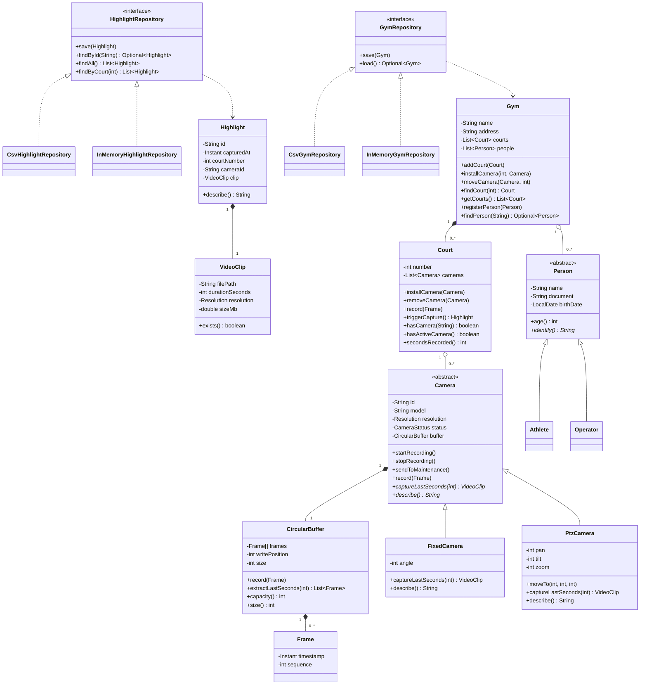

# Domain Model

The classes, their relationships and the reasons those relationships exist in
the delivered application.

## Class diagram

## Relationships

| Relationship | Cardinality | Type | Reason |
|---|---:|---|---|
| Gym → Court | 1 : 0..* | Composition | Courts belong to one gym; a new gym may start empty. |
| Gym → Person | 1 : 0..* | Aggregation | Athletes and operators exist independently of registration. |
| Court → Camera | 1 : 0..* | Aggregation | Cameras can be removed and moved between courts. |
| Camera → CircularBuffer | 1 : 1 | Composition | The buffer is private memory owned by one camera. |
| CircularBuffer → Frame | 1 : 0..* | Composition | Frames exist only as entries in a buffer. |
| Highlight → VideoClip | 1 : 1 | Composition | A highlight cannot exist without its clip metadata. |

Camera identifiers are unique across the whole gym. Installation therefore
goes through `Gym.installCamera(...)`; `Gym.moveCamera(...)` validates the
destination before removing the camera from its current court. A moved camera
arrives inactive and starts with an empty buffer when recording resumes.

A highlight stores the court number and camera identifier as values, rather
than keeping mutable references. It can therefore outlive both objects and be
rebuilt from CSV without reconstructing the capture equipment.

## Object-oriented concepts

- **Encapsulation:** every field is private. Collections are returned as
  unmodifiable copies, and `CircularBuffer` never exposes its frame array.
- **Inheritance:** `FixedCamera` and `PtzCamera` extend `Camera`;
  `Athlete` and `Operator` extend `Person`.
- **Polymorphism:** cameras implement `captureLastSeconds()` and
  `describe()` differently; people implement `identify()` differently.
- **Abstraction:** `HighlightRepository` and `GymRepository` are contracts
  with CSV and in-memory implementations.
- **Domain independence:** no class under `domain/` imports `repository/`
  or Swing.

## Persistence boundaries

`HighlightRepository` stores the permanent highlight archive.
`GymRepository` stores the gym, courts, cameras, their status and PTZ
position. `CsvHighlightRepository` can recover valid highlights around a
damaged line; `CsvGymRepository` rejects a damaged structure as a whole so
the application never runs with half a gym.

## Deliberate omissions

There is no play type, sport, match or highlight author. The physical capture
button carries no identity, so the saved highlight contains only the instant,
court, camera and clip. Real video processing, authentication, scheduling and
a database are outside the project scope.
